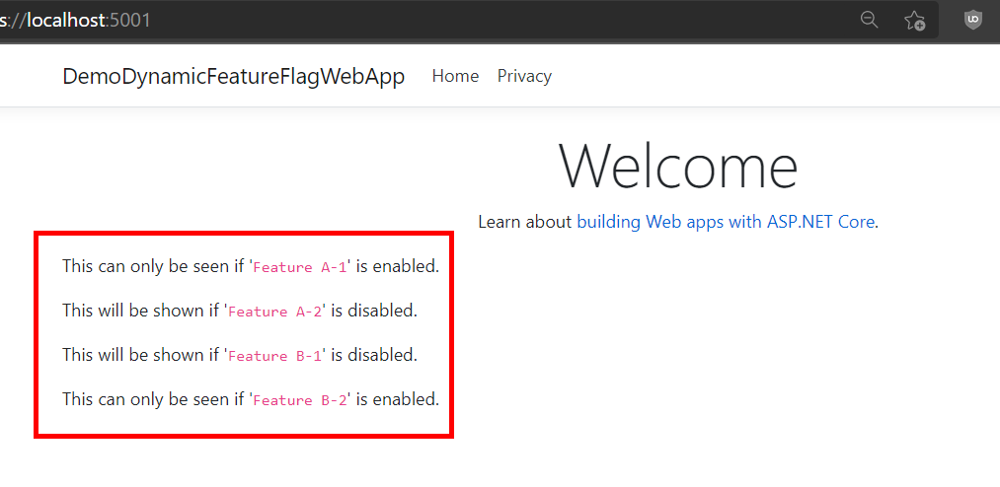

# Dynamic ASP.NET Core Feature Flags Demo

Demo projects using [Microsoft.FeatureManagement.AspNetCore](https://www.nuget.org/packages/Microsoft.FeatureManagement.AspNetCore/) & [GranDen.Configuration.RedisLoader](https://www.nuget.org/packages/GranDen.Configuration.RedisLoader/) to be able to dynamically change site content based on another web app's manipulation on Configuration resides on Redis Cache.

<strong>Front site</strong>

